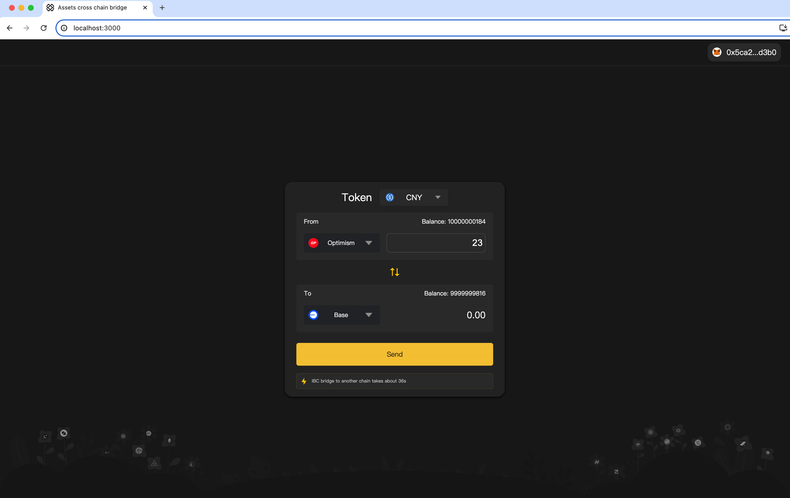

### Project title
Assets cross chain bridge

### Team members
    ziheche

### Project Overview
Assets cross chain bridge is a trusted cross-chain bridge connecting Sepolia-Optimism and Sepolia-Base, utilizing an interface that implements the IBC protocol at its core.

### Run-book
- Contract:
    1. Install dependencies， compile code, deploy contract, you will get two addresses as port address.
        ```shell
        just install
        npx hardhat compile
        just deploy optimism base
        ```
    2. Port address
    Optimism - Sepolia: 0x062aF4E4527565c6F486f7f5b080006397402f2d
    Base - Sepolia: 0x062aF4E4527565c6F486f7f5b080006397402f2d
    3. Copy abi from /artifacts/contracts/AssetsCrossChainBridge.sol/AssetsCrossChainBridge.json
    4. Bridge method is `TransferCNY(address destPortAddr,
            bytes32 channelId,
            uint256 amount)`

- Frontend:
    1. frontend/Assets-cross-chain-page/src/config.js replace `CONTRACT_ADDRESS` with port address and replace `ABI`.
    2. `cd frontend/Assets-cross-chain-page && npm install && npm run start`
    3. You can now view assets-cross-chain-page in the browser: http://localhost:3000

### Resources Used
- react.js
- bignumber.js
- web3.js
- hardhat
- @open-ibc/vibc-core-smart-contracts
### Challenges Faced
Writing smart contract code is simple, it's just hair-raising.
### What We Learned

### Future Improvements
- refactor the smart contract code, remove unnecessary demo code
- add a faucet that users can claim test token
- improve the UI

### Testnet interaction
Optimism: [0x7376703af7ea8d9cb3580c10d2a26198be595ef5cfd7c704a65c57f5fc4120c7](https://optimism-sepolia.blockscout.com/tx/0x7376703af7ea8d9cb3580c10d2a26198be595ef5cfd7c704a65c57f5fc4120c7)
Base: [0x90b75f741b9addeb1d997e7b82c9361ff762c55cc78dde9557266af2f4078a32](https://base-sepolia.blockscout.com/tx/0x90b75f741b9addeb1d997e7b82c9361ff762c55cc78dde9557266af2f4078a32)


### PortAddress
Op: 0x062aF4E4527565c6F486f7f5b080006397402f2d
Base: 0x062aF4E4527565c6F486f7f5b080006397402f2d

### Licence
[Apache 2.0](LICENSE)

